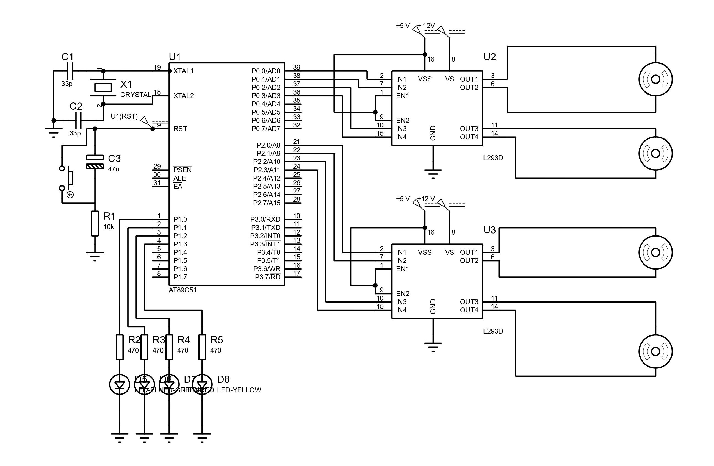

# SENSORS, ACTUATORS, INTERRUPTS & SERIAL COMMUNICATION USING 8051 MICROCONTROLLER

## Problem Statement

**A party hall has 4 fans and 4 lights, for every 50 secs 1 fans should get turned on and for next 50 secs 1 light should get turned on this should continue repeatedly. Upon occurrence of an interrupts transfer serially "PARTY".
Write 8051 microcontroller program to demonstrate the same.**

## Components Required

| Sl No | Component Used         | Specification            | Quantity |
| ----- | ---------------------- | ------------------------ | -------- |
| i.    | 8051 Microcontroller   | AT89C51                  | 1        |
| ii.   | Crystal Oscillator     | 11.0592 MHz              | 1        |
| iii.  | Electrolytic Capacitor | 47 uF                    | 1        |
| iv.   | Ceramic Capacitor      | 33uF                     | 2        |
| v.    | Resistors              | 10k ohms                 | 1        |
| vi.   | Resistors              | 470 ohms                 | 4        |
| vii.  | Button                 | Push Button              | 1        |
| viii. | LED                    | Red, Blue, Green, Yellow | 1 each   |
| ix.   | DC Motor               | +12 V                    | 4        |
| x.    | DC Motor Driver        | L293D                    | 2        |

## Circuit Diagram

